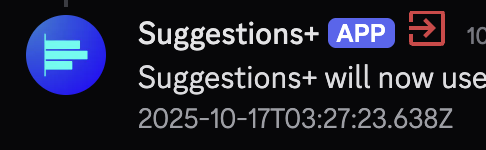

# About

This plugin is simple; it will tell you explicitly when a user has left the server you're in.

## Features

- Shows a new red badge next to a user who's left in messages.
- Shows the same red badge in the profile of a user who's left.
- Shows the same red badge for threads or posts in the channel list, where the OP is left.
    - Note that this feature is a bit buggy, and is restricted to only showing in the thread you've selected.

Here's an example if a message (or in this case, a bot) left the server (I booted a test bot for this):

Now, here's an example where the owner of a forum post left:

# Notes

- The channel badge can be buggy at times. This is partly the way it's implemented, and partly because of Discord's nature of liking to not load things instantly.

# Authors

- Calebh101
